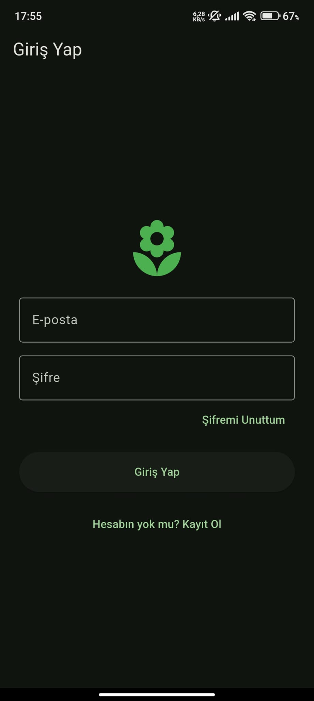
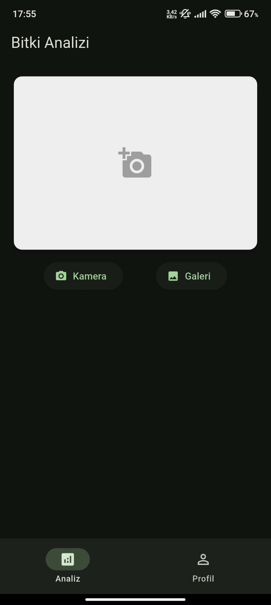
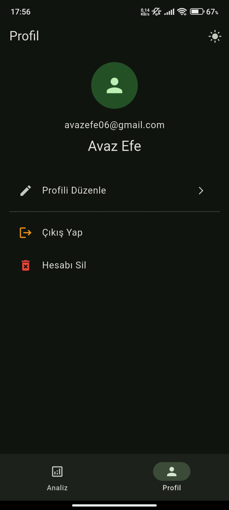
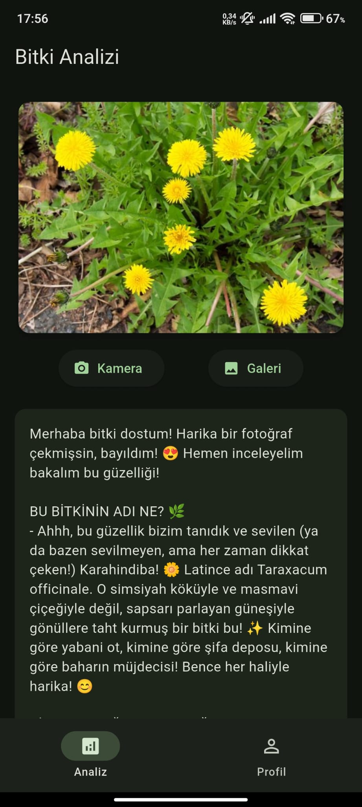
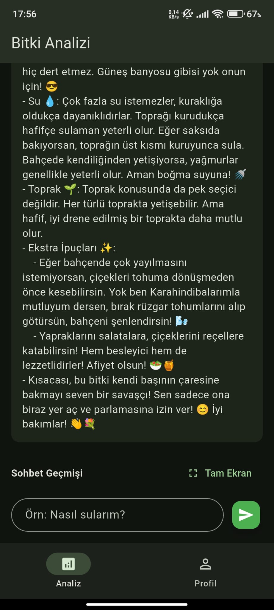

# Bitki Doktorum 🌿📱
**Bitki Doktorum**, Flutter + Firebase + Gemini (google_generative_ai) ile geliştirilmiş; **fotoğraftan bitki analizi** yapan ve analiz sonucunu **sohbet bağlamı** olarak kullanarak kullanıcıyla konuşabilen bir mobil uygulamadır.

---

## 📸 Uygulama Ekran Görüntüleri

> Görseller: `assets/screenshots/` klasöründe.

<div align="center">





<br/><br/>




</div>

---

## 🚀 Proje Özeti
Uygulama, kullanıcıdan alınan bitki fotoğrafını analiz eder ve:
- Bitki türü (tahmin),
- Olası hastalık/zararlı belirtileri,
- Kısa bakım önerileri
şeklinde Türkçe çıktı üretir. Analiz ekranının altındaki sohbet alanında kullanıcı, **aynı analiz bağlamında** sorular sorabilir.

---

## ✨ Özellikler

### 🔍 Bitki Analizi
- Kamera / Galeriden fotoğraf seçme
- Büyük Card içinde fotoğraf önizleme
- Analiz metni **SelectableText** (kopyalanabilir)

### 💬 Analiz Bağlamında Sohbet
- Analiz ekranında gömülü sohbet alanı
- “Tam ekran sohbet” sayfası
- **Yeni sohbet context’i oluşturmaz**: aynı mesaj geçmişi + aynı analiz bağlamı kullanılır
- Sohbet tutarlılığı için en az son 6 mesaj modele aktarılır

### 🔐 Firebase Auth
- Kayıt / Giriş / Çıkış
- Şifremi Unuttum:
  - E-posta doluysa direkt reset mail
  - Boşsa e-posta isteyen dialog
- Mail değiştir / Şifre değiştir:
  - `requires-recent-login` gelirse re-auth modal (mevcut şifre) ile tekrar dener
  - Başarılı olunca güvenlik için logout + login ekranına dönüş
- Hesabı sil:
  - Auth hesabı + Firestore `/users/{uid}` dokümanı silinir

### 👤 Firestore Profil
- Döküman yolu: `/users/{uid}`
- Alanlar: `firstName`, `lastName`, `phone`, `birthDate`, `email`, `createdAt`
- Profil görüntüleme + düzenleme

### 🌓 Tema
- Material 3
- Dark/Light toggle
- SharedPreferences ile kalıcı tema

### 🧯 Stabilite
- Tüm async işlemler try/catch
- Hatalar kullanıcıya SnackBar ile Türkçe gösterilir
- Kurulum eksiklerinde crash yerine kullanıcı dostu uyarı yaklaşımı

---

## 🧱 Teknolojiler ve Paketler
- Flutter (Material 3)
- Firebase: `firebase_core`, `firebase_auth`, `cloud_firestore`
- Gemini: `google_generative_ai`
- Diğer: `image_picker`, `shared_preferences`, `flutter_dotenv`, `intl`, `mime`

---

## ✅ Kurulum

### 1) Projeyi oluştur
```bash
flutter create --org com.example bitki_doktorum
cd bitki_doktorum
